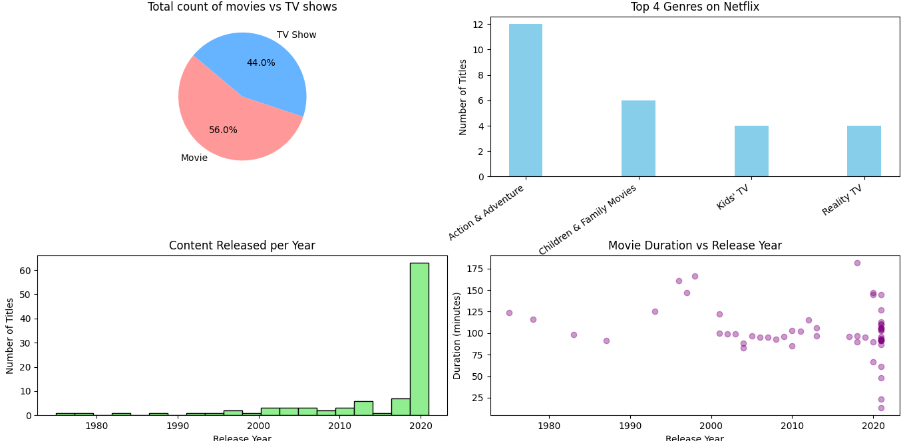

# 📺 Netflix Data Analysis & Visualization

This project explores the **Netflix dataset** using **Python**, **Pandas**, and **Matplotlib** to uncover trends in content type, genre, duration, and release history.

---

## 📂 Dataset Overview

Includes details like:
- Title, Type, Country, Release Year, Rating, Duration, Genre, Date Added, Description

📎 [Dataset Source (Kaggle)](https://www.kaggle.com/datasets/shivamb/netflix-shows)

---

## 🛠 Tools Used
- Python  
- Pandas  
- NumPy  
- Matplotlib  
- VS Code

---

## 🔍 What I Did
- Cleaned and preprocessed the dataset  
- Analyzed patterns in release trends, genres, durations  
- Created a **subplot-based dashboard** to visualize key insights:

  - 🎬 Movies vs TV Shows (Pie Chart)  
  - 🎭 Top Genres (Bar Chart)  
  - 📆 Content Released per Year (Histogram)  
  - ⏱ Movie Duration over Time (Scatter Plot)

---

## 📸 Sample Output

---

## 📌 Key Insights
- Movies dominate over TV Shows  
- Most content was added in 2019–2020  
- “TV-MA” is the most common rating  
- Top genres include Action, Anime, and Comedy  
- Movie durations mostly range from 80–120 minutes

